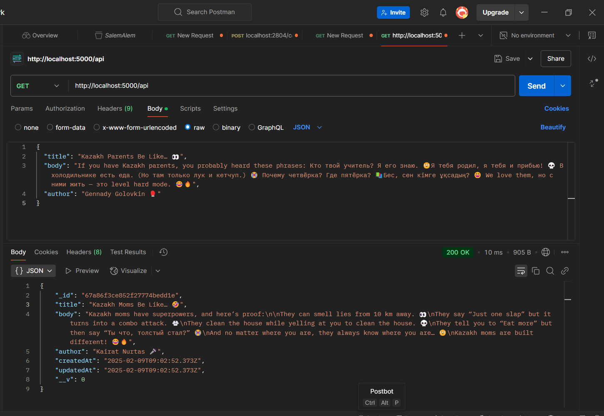
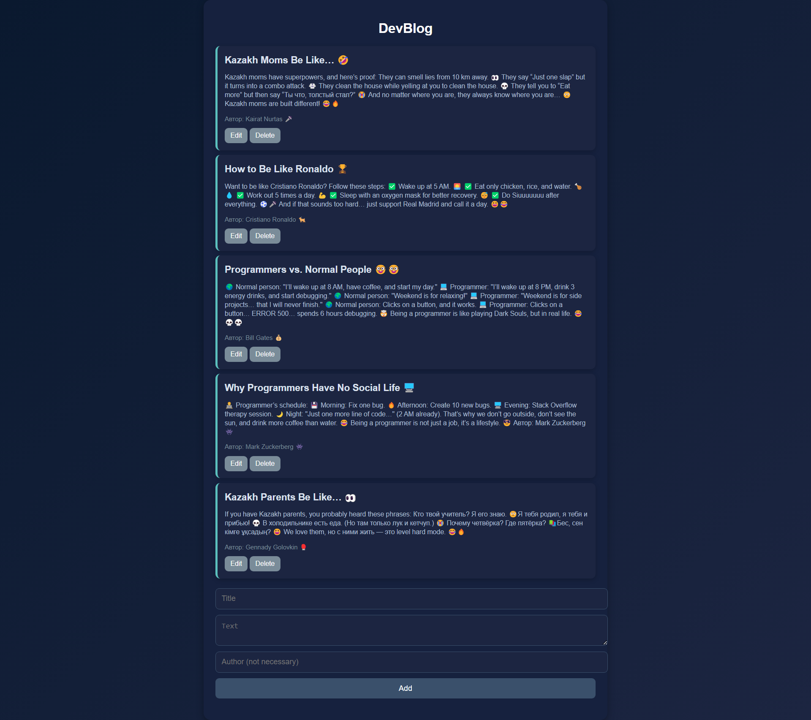
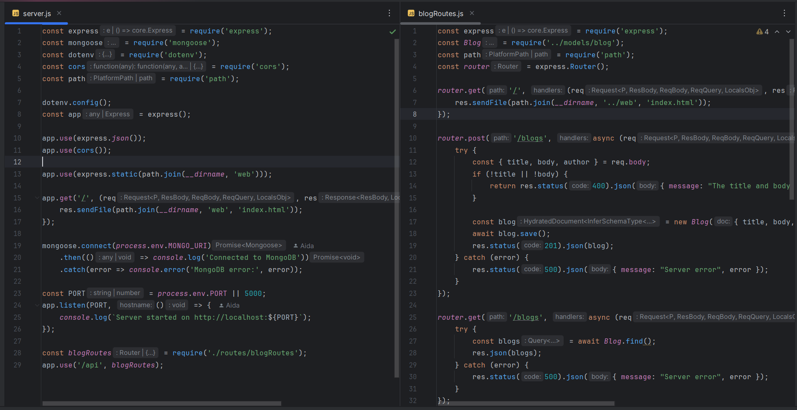

# 📝 DevBlog

A modern blog platform with a **dark theme**, built with **Node.js, MongoDB, and JavaScript**. 🚀

## 🌟 Features
✅ **Dark Mode UI** – Sleek and elegant navy blue design.  
✅ **Full-Stack** – Backend with **Node.js + Express** and database **MongoDB**.  
✅ **CRUD Operations** – Add, edit, delete, and retrieve blog posts.  
✅ **Responsive & Interactive** – Works smoothly on all devices.

## 💾 Assets

## 🛠️ Tech Stack
- **Frontend:** HTML, CSS, JavaScript
- **Backend:** Node.js, Express.js
- **Database:** MongoDB

## 🚀 How to Run
1️⃣ Clone the repo: `git clone git@github.com:zhxauda9/DevBlog.git`
3️⃣ Start backend: `node server.js`  
4️⃣ Open `index.html` in your browser

## 🔥 Future Improvements
- 📝 **User Authentication** – Login & register system
- 💾 **Persistent Storage** – Keep posts after refresh
- 🎨 **Theme Customization** – Light & dark modes

---

📌 **Enjoy blogging!** ✨  
